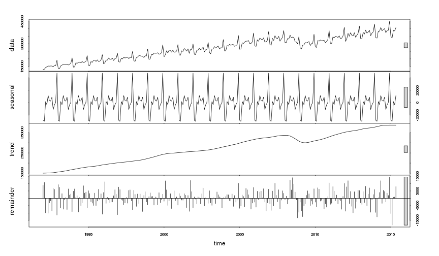

# Solutions 


```r
> # Solution Exercise 1
> Quandl.search("retailers sales", database_code = "FRED")
```

```
Retailers Sales
Code: FRED/RETAILSMSA
Desc: Millions of Dollars Seasonally Adjusted 
Freq: monthly
Cols: Date | Value

Retailers Sales
Code: FRED/RETAILSMNSA
Desc: Millions of Dollars Not Seasonally Adjusted 
Freq: monthly
Cols: Date | Value

Retailers Sales
Code: FRED/RETAILMPCSMSA
Desc: Percent Change Seasonally Adjusted 
Freq: monthly
Cols: Date | Value

Retailers Sales
Code: FRED/RETAILMPCSMNSA
Desc: Percent Change Not Seasonally Adjusted 
Freq: monthly
Cols: Date | Value

Retail Sales (Discontinued Series)
Code: FRED/RETAIL
Desc: Millions of Dollars Seasonally Adjusted, Discontinued Series 
Freq: monthly
Cols: Date | Value

Retail Sales (Discontinued Series)
Code: FRED/RETAILNS
Desc: Millions of Dollars Not Seasonally Adjusted, Discontinued Series 
Freq: monthly
Cols: Date | Value

E-Commerce Retail Sales
Code: FRED/ECOMSA
Desc: Millions of Dollars Seasonally Adjusted, E-Commerce - The sale of goods and services where the buyer places an order, or the price and terms of the sale are negotiated over an Electronic Data Interchange, the Internet, or any other online system (extranet, e-mail, instant messaging). Payment may or may not be made online. 
Freq: quarterly
Cols: Date | Value

E-Commerce Retail Sales
Code: FRED/ECOMNSA
Desc: Millions of Dollars Not Seasonally Adjusted, E-Commerce - The sale of goods and services where the buyer places an order, or the price and terms of the sale are negotiated over an Electronic Data Interchange, the Internet, or any other online system (extranet, e-mail, instant messaging). Payment may or may not be made online. 
Freq: quarterly
Cols: Date | Value

Retail Sales of Shoes for United States
Code: FRED/M06061USM144NNBR
Desc: Millions Of Dollars Not Seasonally Adjusted, Source: See Ruth P. Mack, Consumption And Business Fluctuation, A Case Study Of The Shoe, Leather, Hide Sequence (NBER), 1956, P. 268, Series 31.  This NBER data series m06061 appears on the NBER website in Chapter 6 at http://www.nber.org/databases/macrohistory/contents/chapter06.html.  NBER Indicator: m06061 
Freq: monthly
Cols: Date | Value

Real Retail Sales (Discontinued Series)
Code: FRED/RSALES
Desc: Millions of Dollars Seasonally Adjusted, Deflated Using the Consumer Price Index for All Urban Consumers (1982-84=100) 
Freq: monthly
Cols: Date | Value
```

```r
> # Solution Exercise 2
> sales <- Quandl("FRED/RETAILSMNSA", type = "ts")
> 
> sales_stl <- stl(sales, s.window = "periodic")
> plot(sales_stl)
```



```r
> sales_adj <- sales_stl$time.series[,"remainder"]
> head(sales_adj)
```

```
[1]   8870.8853  10793.2752  -9851.5855   -542.1228 -10187.8298  -3183.1963
```
