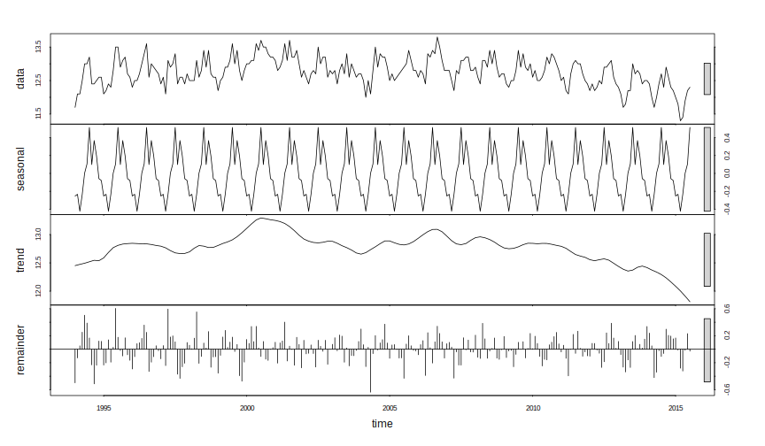

# `stl()` function


```r
> stl(x, s.window = "periodic")
> # additional arguments removed
```

with the two mandatory arguments `x`, for the time series data, and `s.window` chosen as *periodic* assuming that the seasonal pattern is constant through time. On the help page of the function is mentioned that `x` should be a `ts` object.

More about the theory behind this function can be found [here](http://cs.wellesley.edu/~cs315/Papers/stl%20statistical%20model.pdf).

As an example we analyze monthly birth rates data for France
from the *National Institute of Statistics and Economic Studies (France)* database.


```r
> births <- Quandl("INSEE/62_001641602_M", type = "ts")
> plot(births)
```


It is obvious that the birth rates time series exhibits a seasonal pattern and a trend component.


```r
> births_stl <- stl(births, s.window = "periodic")
> # s.window = "periodic" means that we assume the seasonal pattern
> # is constant through time
> 
> plot(births_stl)
```



`stl()` function returns a matrix with the seasonal, trend and remainder component.

```r
> stl_mat <- births_stl$time.series
> head(stl_mat)
```

```
         seasonal    trend   remainder
[1,] -0.253229421 12.45112 -0.49789058
[2,] -0.233778895 12.46242 -0.12864439
[3,] -0.423419212 12.47373  0.04969264
[4,] -0.235228039 12.48372  0.25150890
[5,]  0.002962996 12.49371  0.50332530
[6,]  0.106144514 12.50664  0.38721940
```
