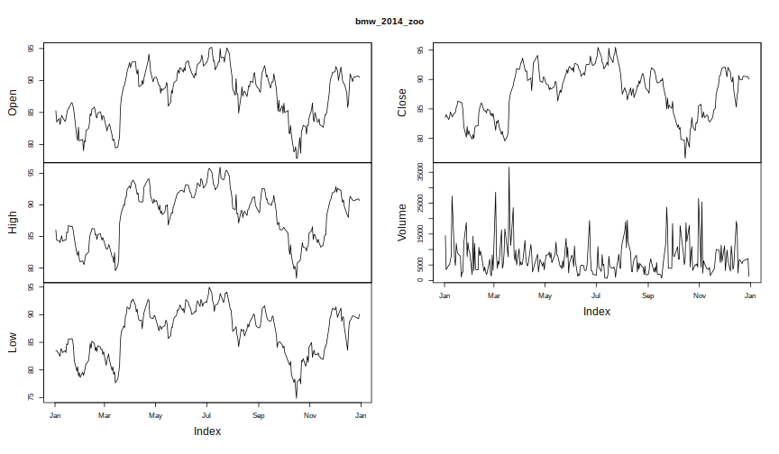

# Downloading Data from Quandl Databases

The workhorse is the `Quandl()` function.

```r
> Quandl(code, type = c("raw", "ts", "zoo", "xts", "timeSeries"), start_date,
+   end_date, transformation = c("", "diff", "rdiff", "normalize", "cumul",
+   "rdiff_from"), collapse = c("", "daily", "weekly", "monthly", "quarterly",
+   "annual"), sort = c("desc", "asc"), meta = FALSE,
+   authcode = Quandl.auth(), ...)
```

You can start downloading data by only using the `code` argument.
Codes can be found on the website of [Quandl](https://www.quandl.com) 
or you can query the databases directly within `R`. (see chapter 1.4).
Suppose we want the data for the automobile manufacturer *BMW* from Frankfurt Stock Exchange
using Google Finance as database.


```r
> bmw <- Quandl("GOOG/FRA_BMW")
```


```r
> str(bmw)
```

```
'data.frame':	1193 obs. of  6 variables:
 $ Date  : Date, format: "2015-09-14" "2015-09-11" ...
 $ Open  : num  86 86.4 85 86.7 81.3 ...
 $ High  : num  86.2 86.4 87 88.2 84.9 ...
 $ Low   : num  85 85.1 84.6 85.4 81.2 ...
 $ Close : num  85.5 86.1 86.5 85.4 84.2 ...
 $ Volume: num  1897 4836 9095 11818 5177 ...
 - attr(*, "freq")= chr "daily"
```


```r
> head(bmw)
```

```
        Date  Open  High   Low Close Volume
1 2015-09-14 86.00 86.24 84.98 85.55   1897
2 2015-09-11 86.40 86.40 85.10 86.07   4836
3 2015-09-10 85.05 87.00 84.60 86.48   9095
4 2015-09-09 86.70 88.23 85.38 85.38  11818
5 2015-09-08 81.30 84.87 81.20 84.25   5177
6 2015-09-07 81.10 81.40 80.66 80.74   3323
```


```r
> tail(bmw)
```

```
           Date  Open  High   Low Close Volume
1188 2011-01-10 58.90 59.26 58.43 58.56  13532
1189 2011-01-07 59.55 60.07 58.83 59.47  15508
1190 2011-01-06 60.00 61.02 59.70 59.83   8911
1191 2011-01-05 60.40 60.55 58.42 60.06  21851
1192 2011-01-04 61.44 61.57 60.09 60.77  30843
1193 2011-01-03 59.70 61.54 59.70 61.31  19869
```


```r
> summary(bmw)
```

```
      Date                 Open             High             Low        
 Min.   :2011-01-03   Min.   :  0.00   Min.   : 46.64   Min.   : 43.56  
 1st Qu.:2012-02-28   1st Qu.: 61.19   1st Qu.: 61.78   1st Qu.: 60.50  
 Median :2013-05-06   Median : 72.04   Median : 72.63   Median : 71.30  
 Mean   :2013-05-04   Mean   : 75.42   Mean   : 76.29   Mean   : 74.54  
 3rd Qu.:2014-07-09   3rd Qu.: 87.61   3rd Qu.: 88.41   3rd Qu.: 86.16  
 Max.   :2015-09-14   Max.   :122.89   Max.   :123.70   Max.   :120.22  
                      NA's   :2        NA's   :2        NA's   :2       
     Close            Volume      
 Min.   : 44.94   Min.   :     0  
 1st Qu.: 61.28   1st Qu.:  5723  
 Median : 71.97   Median :  9479  
 Mean   : 75.44   Mean   : 12352  
 3rd Qu.: 87.27   3rd Qu.: 15211  
 Max.   :123.00   Max.   :185389  
                                  
```

# Using additional arguments of `Quandl()` function

The function call `Quandl("GOOG/FRA_BMW")` without any additional arguments returns a data frame
with six columns, namely 'Date', 'Open', 'High', 'Low', 'Close' and 'Volume' for
all available dates. Furthermore, the data frame is returned in descending order.
Our R object `bmw` ranges from 2011-01-03 to 2015-09-14.

If you want to truncate your time series the two arguments `start_date` and `end_date`
of the `Quandl` function can be used.

In a next step, we only want to download the BMW data for 2014 and we want the ordering 
of the data to change from descending to ascending. 
Both arguments `start_date` and `end_date` have to be in the format 'yyyy-mm-dd'.


```r
> bmw_2014 <- Quandl("GOOG/FRA_BMW", start_date = "2014-01-01", end_date = "2014-12-31",
+                    sort = "asc")
```


```r
> str(bmw_2014)
```

```
'data.frame':	252 obs. of  6 variables:
 $ Date  : Date, format: "2014-01-02" "2014-01-03" ...
 $ Open  : num  85.3 83.5 84 83.1 83.9 ...
 $ High  : num  86 84.4 84.3 84 84.6 ...
 $ Low   : num  83.5 83.5 82.9 82.5 83.8 ...
 $ Close : num  83.5 84 83.2 83.6 84.5 ...
 $ Volume: num  14509 3476 4932 5129 6477 ...
 - attr(*, "freq")= chr "daily"
```


```r
> head(bmw_2014)
```

```
        Date  Open  High   Low Close Volume
1 2014-01-02 85.28 86.01 83.50 83.54  14509
2 2014-01-03 83.50 84.40 83.50 84.03   3476
3 2014-01-06 84.05 84.33 82.86 83.19   4932
4 2014-01-07 83.10 84.01 82.47 83.60   5129
5 2014-01-08 83.90 84.64 83.83 84.46   6477
6 2014-01-09 84.55 85.11 83.72 84.18   7907
```

Comparing both R objects `bmw` and `bmw_2014` we have reduced the observations for each 
of the columns from 1193 to 252.
The dates we have data for range from 2014-01-02 to 2014-12-30.

By default, `Quandl()` returns data as class `data.frame` which is not the best
output type when dealing with time series.

`Quandl()` offers several different output classes,

* data.frame
* ts
* zoo
* xts
* timeSeries,

which can be chosen with `type` argument.

An overview about the different classes and corresponding packages can be found in the 
[CRAN Task View: Time Series Analysis](https://cran.r-project.org/web/views/TimeSeries.html) or
in the pdf [Working with Financial Time Series Data in R](http://faculty.washington.edu/ezivot/econ424/Working%20with%20Time%20Series%20Data%20in%20R.pdf) written by Eric Zivot.

To get an output with class `zoo` the function call would look like this:

```r
> bmw_2014_zoo <- Quandl("GOOG/FRA_BMW", start_date = "2014-01-01", end_date = "2014-12-31",
+                    sort = "asc", type = "zoo")
```

Let's have a look at what the standard `plot` function produces for both classes.

```r
> plot(bmw_2014)
```

 

```r
> plot(bmw_2014_zoo)
```

 

First call produces a scatterplot matrix whereas the columns of the data frame are plotted against each other.
Second call returns plotted time series for each column which is more appropriate for our data.

The reason for this behavior is that 'plot' function checks the classes of the objects to be visualized. 
So under the hood for an object with class 'data.frame' the function 'plot.data.frame' from package `graphics` is used
and for objects with class 'zoo' the 'plot.zoo' function in package `zoo`.

Now we have data on a daily basis but `Quandl()` offers several more choices like,

* weekly
* monthly
* quarterly 
* annual,

which can be achived using the `collapse` argument.
By collapsing a daily dataset to weekly,
you will get a sample of the original dataset where the observation for each week
is the last data point available for that week.

To download weekly data of 2014 for BMW equity from Frankfurt Stock Exchange
the function call would be

```r
> bmw_2014_zoo_weekly <- Quandl("GOOG/FRA_BMW",
+                              start_date = "2014-01-01", end_date = "2014-12-31",
+                              sort = "asc", type = "zoo", collapse = "weekly")
```


```r
> str(bmw_2014_zoo_weekly)
```

```
'zoo' series from 2014-01-05 to 2015-01-04
  Data: num [1:53, 1:5] 83.5 84.3 85.6 84.7 80.6 ...
 - attr(*, "dimnames")=List of 2
  ..$ : NULL
  ..$ : chr [1:5] "Open" "High" "Low" "Close" ...
  Index:  Date[1:53], format: "2014-01-05" "2014-01-12" "2014-01-19" "2014-01-26" ...
```


```r
> head(bmw_2014_zoo_weekly)
```

```
            Open  High   Low Close Volume
2014-01-05 83.50 84.40 83.50 84.03   3476
2014-01-12 84.26 84.26 83.14 83.65  27281
2014-01-19 85.57 86.73 85.56 86.34   8630
2014-01-26 84.72 84.75 81.69 81.97  12149
2014-02-02 80.62 80.98 78.66 80.72   9208
2014-02-09 82.15 82.15 81.08 82.07   3565
```

It is also possible to apply various transformations to the data.

Suppose we have a time series with time stamps $i = 0, \ldots, I$,
where $x_0$ refers to the starting date for the API call specified by `start_date`
and $x_I$ refers to the end point specified by `end_date`.

Possible values for the `transform` argument are

* none: leave the data as it is
* diff: shows the row - on - row change; 
  $$x^{*}_i = x_i - x_{i-1}$$
  
* rdiff: shows the relative row - on - row change; 
  $$ x^{*}_i = \dfrac{(x_i - x_{i-1})}{x_{i-1}} $$
  
* normalize: set starting value at 100; 
  $$ x^{*}_i = \dfrac{x_i}{x_0} \cdot 100 $$
  
* cumul: shows the cumulative sum; 
  $$ x^{*}_i =  x_i + x_{i-1} + x_{i-2} + \ldots + x_0 $$
  
* rdiff_from: shows ratio between the latest point and an earlier point; 
  $$ x^{*}_i = \dfrac{(x_I - x_{i})}{x_{i}} $$

Furthermore, you can select single columns of the data. 
If we want the returns of the closing prices (fourth column) of 2014 for BMW 
we have to call the Quandl function like this


```r
> bmw_2014_returns_closing <- Quandl("GOOG/FRA_BMW.4",
+                                    start_date = "2014-01-01", end_date = "2014-12-31",
+                                    sort = "asc", type = "zoo", transform = "rdiff")
> 
> plot(bmw_2014_returns_closing, main = "BMW closing price returns 2014",
+      ylab = "Returns", xlab = "Date")
```

 

```r
> summary(bmw_2014_returns_closing)
```

```
     Index            bmw_2014_returns_closing
 Min.   :2014-01-03   Min.   :-0.0387704      
 1st Qu.:2014-04-01   1st Qu.:-0.0078668      
 Median :2014-07-02   Median : 0.0006620      
 Mean   :2014-07-01   Mean   : 0.0003888      
 3rd Qu.:2014-09-27   3rd Qu.: 0.0084222      
 Max.   :2014-12-30   Max.   : 0.0606808      
```

Finally, you can also get meta data. 
The only thing needed to receive this information is to switch the `meta` argument 
from **FALSE** to **TRUE**.


```r
> bmw_2014_zoo_meta <- Quandl("GOOG/FRA_BMW", start_date = "2014-01-01", end_date = "2014-12-31",
+                       sort = "asc", type = "zoo", meta = TRUE)
> str(bmw_2014_zoo_meta, "meta")
```

```
'zoo' series from 2014-01-02 to 2014-12-30
  Data: num [1:252, 1:5] 85.3 83.5 84 83.1 83.9 ...
 - attr(*, "dimnames")=List of 2
  ..$ : NULL
  ..$ : chr [1:5] "Open" "High" "Low" "Close" ...
 - attr(*, "meta")=List of 9
  ..$ frequency         : chr "daily"
  ..$ name              : chr "Bayerische Motoren Werke AG (BMW)"
  ..$ description       : chr "Bayerische Motoren Werke AG is a German holding company and automobile manufacturer that focuses on the automobile and motorcyc"| __truncated__
  ..$ updated           : chr "2015-09-14T20:59:41.739Z"
  ..$ source_code       : chr "GOOG"
  ..$ code              : chr "GOOG/FRA_BMW"
  ..$ source_name       : chr "Google Finance"
  ..$ source_link       : chr "www.google.com"
  ..$ source_description: chr "This data is NOT sourced directly from Google.  It is however verified against their numbers.\r\n\r\nwww.quandl.com/WIKI is a b"| __truncated__
  Index:  Date[1:252], format: "2014-01-02" "2014-01-03" "2014-01-06" "2014-01-07" ...
```

The `meta` attribute of the object `bmw_2014_zoo_meta` is a list with 9 entries, such as frequency, name, description and so on.
Assuming that we are interested in an extended description of BMW we can get this with


```r
> attr(bmw_2014_zoo_meta,"meta")$description
```


```
Bayerische Motoren Werke AG is a German holding company and automobile manufacturer that 
focuses on the automobile and motorcycle markets. It divides its activities into the
three main segments: Automobiles, Motorcycles and Financial Services.
It owns three brands: BMW, MINI and Rolls-Royce. Its BMW automobile range
encompasses the 1 Series, including three-door, five-door, coupe and convertible models;
the 3 Series, including sedan, touring, coupe and convertible models;
the 5 Series, available in sedan and touring models;
the 6 Series, available as a coupe or convertible;
the 7 Series large sedan; the Z4 roadster and coupe;
the sports utility vehicles, X3, X5 and X6 and M models, such as M3, M5 and M6.
It also offers cars under the MINI brand and motorcycles under the BMW brand.
The Rolls-Royce brand offers three luxury cars, Phantom, Coupe and Ghost.
It has producing, assembly, service and sales subsidiaries throughout the world.
In January 2013, it sold its Husqvarna brand.
```
