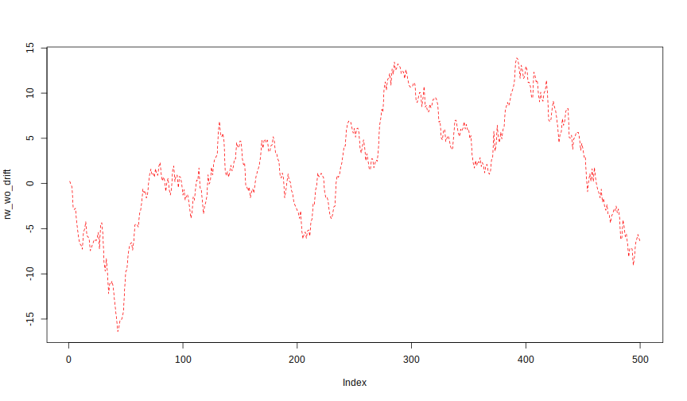
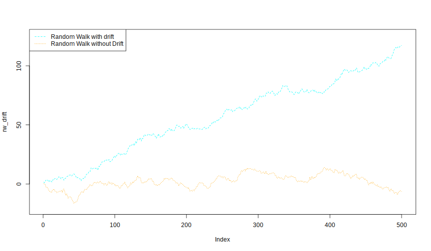

# Solutions


```r
> # Solution Exercise 1:
> set.seed(111)
> wn <- rnorm(500, mean = 0, sd = 1)
> rw_wo_drift <- cumsum(wn)
> plot(rw_wo_drift, type = "l", lty = "dashed", col = "red")
```




```r
> # Solution Exercise 2:
> wn_drift <- rnorm(500, mean = 0, sd = 1)
> rw_drift <- cumsum(wn_drift + 0.2)
> 
> plot(rw_drift, type = "l", lty = "dashed", col = "cyan", ylim = c(-20,125))
> lines(rw_wo_drift, lty = "dotted", col = "orange")
> legend("topleft", 
+        legend = c("Random Walk with drift", "Random Walk without Drift"),
+        col = c("cyan", "orange"),
+        lty = c("dashed", "dotted"))
```




```r
> # Solution Exercise 3:
> 
> Box.test(rw_wo_drift, type = "Box-Pierce")
```

```

	Box-Pierce test

data:  rw_wo_drift
X-squared = 484.58, df = 1, p-value < 2.2e-16
```

```r
> Box.test(rw_wo_drift, type = "Ljung-Box")
```

```

	Box-Ljung test

data:  rw_wo_drift
X-squared = 487.49, df = 1, p-value < 2.2e-16
```

```r
> Box.test(rw_drift, type = "Box-Pierce")
```

```

	Box-Pierce test

data:  rw_drift
X-squared = 492.97, df = 1, p-value < 2.2e-16
```

```r
> Box.test(rw_drift, type = "Ljung-Box")
```

```

	Box-Ljung test

data:  rw_drift
X-squared = 495.93, df = 1, p-value < 2.2e-16
```

```r
> Box.test(diff(rw_wo_drift), type = "Box-Pierce")
```

```

	Box-Pierce test

data:  diff(rw_wo_drift)
X-squared = 0.5729, df = 1, p-value = 0.4491
```

```r
> Box.test(diff(rw_wo_drift), type = "Ljung-Box")
```

```

	Box-Ljung test

data:  diff(rw_wo_drift)
X-squared = 0.57635, df = 1, p-value = 0.4477
```

```r
> # White Noise
```
