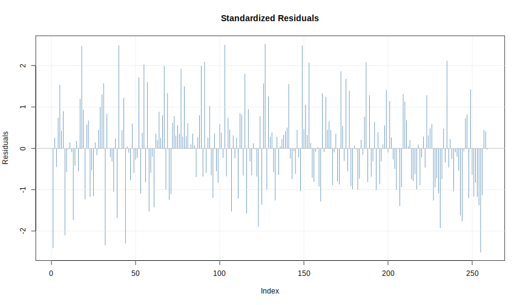
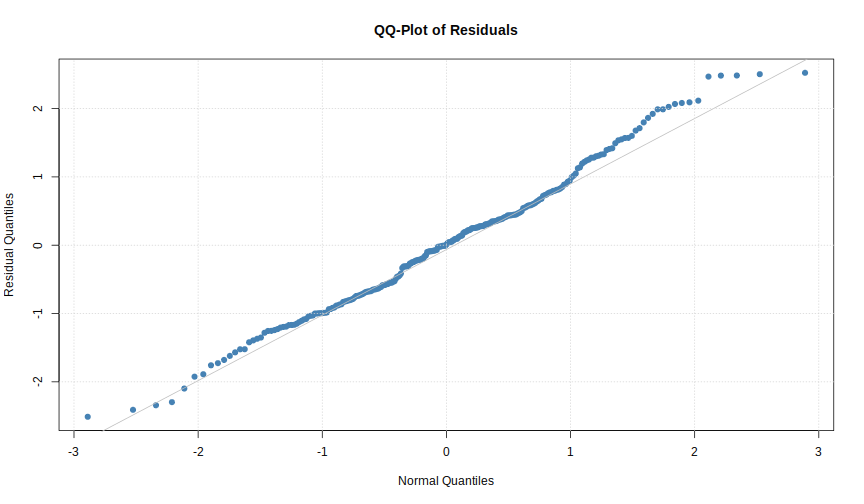
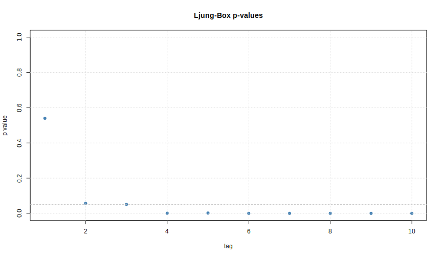

# `fArma` package

Install and/or load the library with the following commands.


```r
> ## install.packages("fArma") # only necessary if package has not been installed yet
> library(fArma)
```

We will use the `armaFit()` function from the `fArma` package for fitting ARMA models to historical time series.


```r
> armaFit(formula, data, method = "ML")
> # additional arguments removed
```

With `formula` argument one can specify which type of ARMA model should be fitted to `data`, which is the time series. 
Mandatory argument `formula` can be set in a `~arma(p,q)` style with the AR order \\(p\\) and the MA order \\(q\\).
Using the birth rates time series from the previous chapter one can fit a ARMA(1,1) to the data with the following line of code.

```r
> births_arma <- armaFit(formula = ~arma(1,1), data = births, method = "ML")
> class(births_arma)
```

```
[1] "fARMA"
attr(,"package")
[1] "fArma"
```

Applying the `summary` function to the `births_arma` object, which has class `fARMA`, by default gives an overview about the results
of the model estimation and produces some plots which can be used to interpret the goodness of fit.


```r
> summary(births_arma)
```

```

Title:
 ARIMA Modelling 

Call:
 armaFit(formula = ~arma(1, 1), data = births, method = "ML")

Model:
 ARIMA(1,0,1) with method: ML

Coefficient(s):
      ar1        ma1  intercept  
   0.7687    -0.1488    12.7445  

Residuals:
      Min        1Q    Median        3Q       Max 
-0.781911 -0.221195  0.002746  0.181625  0.785509 

Moments: 
Skewness Kurtosis 
  0.2021  -0.1095 

Coefficient(s):
           Estimate  Std. Error  t value Pr(>|t|)    
ar1         0.76871     0.05216   14.737   <2e-16 ***
ma1        -0.14882     0.06881   -2.163   0.0306 *  
intercept  12.74449     0.07050  180.764   <2e-16 ***
---
Signif. codes:  0 '***' 0.001 '**' 0.01 '*' 0.05 '.' 0.1 ' ' 1

sigma^2 estimated as: 0.09689
log likelihood:       -65.57
AIC Criterion:        139.14
```

```

Description:
 Mon Sep 21 20:27:46 2015 by user:  
```




One can also forecast the time series with the `predict()` function. By default ten values are predicted.


```r
> predict(births_arma)
```


```
$pred
Time Series:
Start = 260 
End = 269 
Frequency = 1 
 [1] 12.40390 12.48268 12.54323 12.58978 12.62557 12.65307 12.67422
 [8] 12.69047 12.70297 12.71257

$se
Time Series:
Start = 260 
End = 269 
Frequency = 1 
 [1] 0.3112787 0.3662336 0.3951305 0.4112526 0.4204889 0.4258525 0.4289904
 [8] 0.4308338 0.4319195 0.4325597

$out
Time Series:
Start = 260 
End = 269 
Frequency = 1 
     Low 95  Low 80 Forecast High 80 High 95
260 11.7938 12.0050  12.4039 12.8028 13.0140
261 11.7649 12.0133  12.4827 12.9520 13.2005
262 11.7688 12.0369  12.5432 13.0496 13.3177
263 11.7837 12.0627  12.5898 13.1168 13.3958
264 11.8014 12.0867  12.6256 13.1644 13.4497
265 11.8184 12.1073  12.6531 13.1988 13.4877
266 11.8334 12.1244  12.6742 13.2240 13.5150
267 11.8461 12.1383  12.6905 13.2426 13.5349
268 11.8564 12.1494  12.7030 13.2565 13.5495
269 11.8648 12.1582  12.7126 13.2669 13.5604
```
