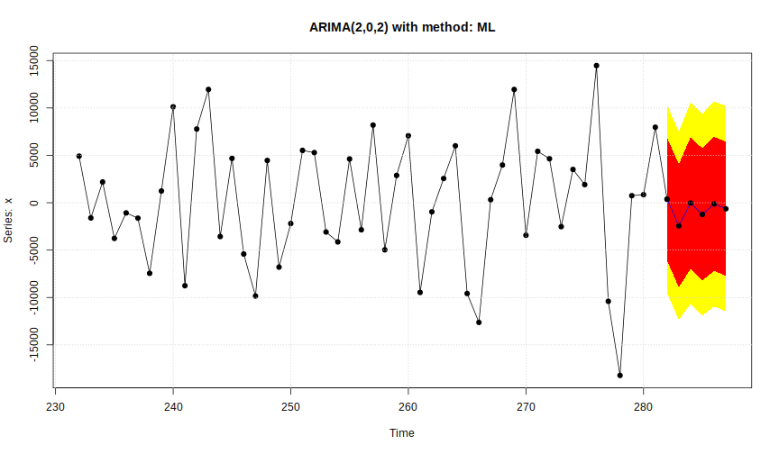
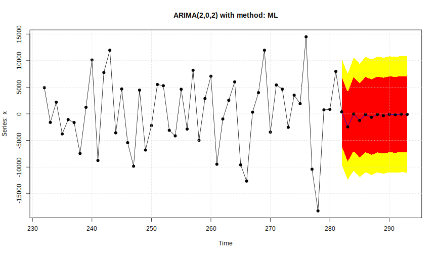

# Solutions


```r
> # Solution Exercise 1
> ar1 <- armaFit(~arma(1,0), data = sales_adj, method = "ML")
> ma1 <- armaFit(~arma(0,1), data = sales_adj, method = "ML")
> arma11 <- armaFit(~arma(1,1), data = sales_adj, method = "ML")
> arma22 <- armaFit(~arma(2,2), data = sales_adj, method = "ML")
> 
> ar1@fit$aic
```

```
[1] 5650.282
```

```r
> ma1@fit$aic
```

```
[1] 5650.132
```

```r
> arma11@fit$aic
```

```
[1] 5625.291
```

```r
> arma22@fit$aic
```

```
[1] 5606.146
```

```r
> # Solution Exercise 2
> polyroot(c(1, -arma22@fit$coef[c("ar1","ar2")]))
```

```
[1]  1.319270+0i -1.493212+0i
```

```r
> polyroot(c(1, arma22@fit$coef[c("ma1","ma2")]))
```

```
[1]  1.000006+0i -1.118498+0i
```

```r
> # No unit roots in common and all unit roots lie outside the unit circle
> 
> # Solution Exercise 3
> predict(arma22, n.ahead = 6)
```

 

```
$pred
Time Series:
Start = 282 
End = 287 
Frequency = 1 
[1]   370.6403 -2440.2996   -26.7705 -1240.5703  -122.5735  -640.0144

$se
Time Series:
Start = 282 
End = 287 
Frequency = 1 
[1] 5062.622 5063.102 5424.545 5428.537 5521.097 5524.525

$out
Time Series:
Start = 282 
End = 287 
Frequency = 1 
        Low 95    Low 80   Forecast  High 80   High 95
282  -9551.917 -6117.371   370.6403 6858.652 10293.198
283 -12363.797 -8928.926 -2440.2996 4048.327  7483.198
284 -10658.684 -6978.605   -26.7705 6925.064 10605.143
285 -11880.307 -8197.520 -1240.5703 5716.380  9399.166
286 -10943.725 -7198.144  -122.5735 6952.997 10698.578
287 -11467.884 -7719.978  -640.0144 6439.949 10187.855
```

```r
> predict(arma22, n.ahead = 12)
```

 

```
$pred
Time Series:
Start = 282 
End = 293 
Frequency = 1 
 [1]   370.64031 -2440.29955   -26.77050 -1240.57028  -122.57350
 [6]  -640.01444  -118.17793  -334.76793   -88.99403  -177.23967
[11]   -60.27008   -94.73780

$se
Time Series:
Start = 282 
End = 293 
Frequency = 1 
 [1] 5062.622 5063.102 5424.545 5428.537 5521.097 5524.525 5549.721
 [8] 5551.626 5558.732 5559.607 5561.666 5562.028

$out
Time Series:
Start = 282 
End = 293 
Frequency = 1 
        Low 95    Low 80   Forecast  High 80   High 95
282  -9551.917 -6117.371   370.6403 6858.652 10293.198
283 -12363.797 -8928.926 -2440.2996 4048.327  7483.198
284 -10658.684 -6978.605   -26.7705 6925.064 10605.143
285 -11880.307 -8197.520 -1240.5703 5716.380  9399.166
286 -10943.725 -7198.144  -122.5735 6952.997 10698.578
287 -11467.884 -7719.978  -640.0144 6439.949 10187.855
288 -10995.431 -7230.431  -118.1779 6994.075 10759.075
289 -11215.754 -7449.462  -334.7679 6779.927 10546.219
290 -10983.908 -7212.796   -88.9940 7034.807 10805.920
291 -11073.869 -7302.163  -177.2397 6947.683 10719.390
292 -10960.936 -7187.833   -60.2701 7067.292 10840.396
293 -10996.113 -7222.764   -94.7378 7033.288 10806.637
```
