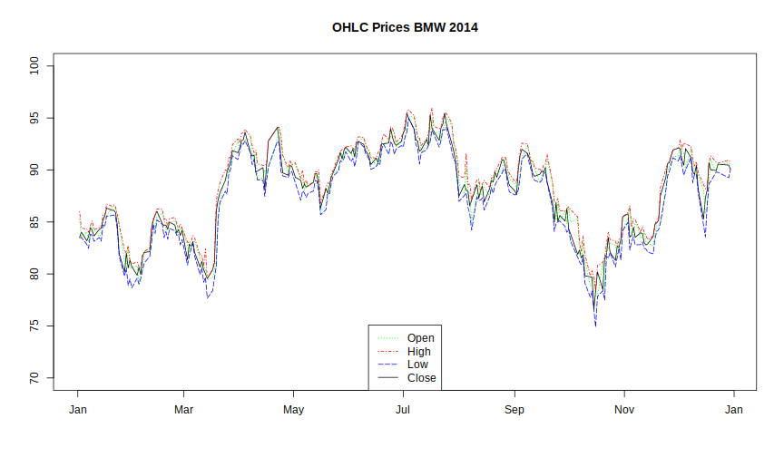

# legend()

For a more readable graphic we also add a legend to our graph.


```r
> # Creating base plot
> 
> plot(x = bmw_2014[,"Date"], y = bmw_2014[,"Close"], 
+      type = "l", xlab = "", ylab = "",
+      main = "OHLC Prices BMW 2014", ylim = c(70,100))
> 
> # adding lines to the existing plot device
> 
> lines(x = bmw_2014[,"Date"], y = bmw_2014[,"Open"],
+       col = "green", lty = "dotted")
> lines(x = bmw_2014[,"Date"], y = bmw_2014[,"High"],
+       col = "red", lty = "dotdash")
> lines(x = bmw_2014[,"Date"], y = bmw_2014[,"Low"],
+       col = "blue", lty = "longdash")
> 
> # adding a legend
> 
> legend("bottom", # position of the legend
+        legend = c("Open", "High", "Low", "Close"), # displayed names
+        col = c("green", "red", "blue", "black"), # displayed colors
+        lty = c("dotted", "dotdash", "longdash", "solid")) # displayed linetypes
```


