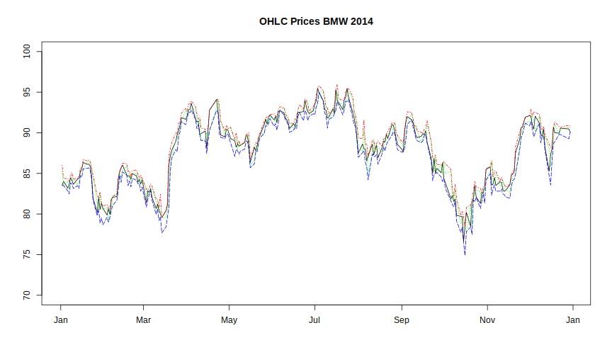

# lines()

With the `lines()` function it is possible to plot two or more time series together.
We want the **Open**, **High**, **Low** and **Close** Prices all together in one plot.


```r
> # Creating base plot
> 
> plot(x = bmw_2014[,"Date"], y = bmw_2014[,"Close"], 
+      type = "l", xlab = "", ylab = "",
+      main = "OHLC Prices BMW 2014", ylim = c(70,100))
> 
> # adding lines to the existing plot device
> 
> lines(x = bmw_2014[,"Date"], y = bmw_2014[,"Open"],
+       col = "green", lty = "dotted")
> lines(x = bmw_2014[,"Date"], y = bmw_2014[,"High"],
+       col = "red", lty = "dotdash")
> lines(x = bmw_2014[,"Date"], y = bmw_2014[,"Low"],
+       col = "blue", lty = "longdash")
```


