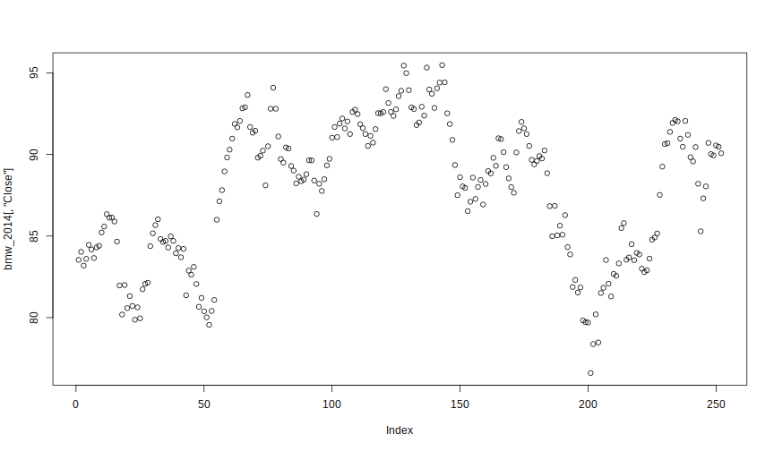
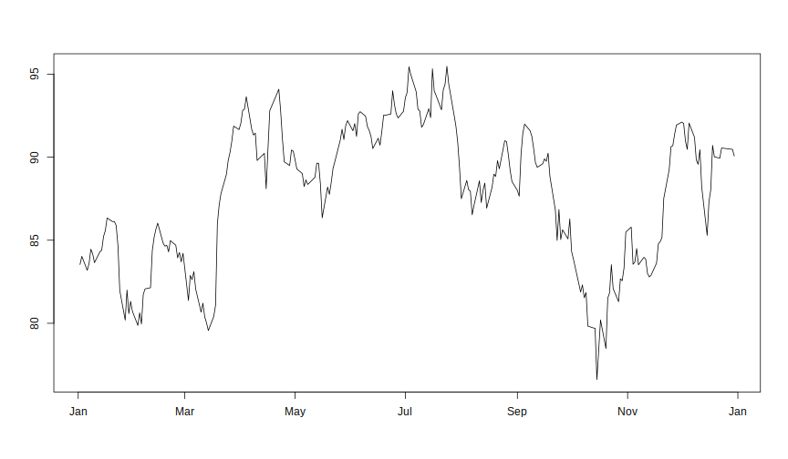

# plot()

The base `R` `plot()` function is a good starting point for visualization our time series. 

```r
> plot(x, y, ...)
```
The mandatory argument **x** describes the coordinates of the points in the plot, **y** is optional if **x** is already an appropriate structure. 
The three dots **...** stand for further graphical parameters which can be passed to methods. 
Additional informations can be found at the help page of the `plot()` function (`?plot` in the R console).

Now suppose we have downloaded historical closing prices for 2014 for the *BMW* equity from Frankfurt Stock Exchange as a `data.frame`.
(See chapter *Using Quandl with R*)


We will start with plotting the closing prices.
The first function call uses only the mandatory argument,
the second explicitly specifies \\(x\\) and \\(y\\) values. 


```r
> plot(x = bmw_2014[,"Close"])
```



```r
> plot(x = bmw_2014[,"Date"], y = bmw_2014[,"Close"])
```


These function calls produce  point plots with the closing prices on the \\(y\\) - axis but the \\(x\\) - axis differ.
In the first plot the index numbers of the \\(y\\) - values are represented on the \\(x\\) - axis so you can see the length 
of the object. Due to the fact that the *Date* column contains entries of class `Date` the ticks on the \\(x\\) - axis in the 
second plot are labelled with the names of the months instead of index numbers.


We change from a point plot to a line plot which is often much more appropriate for time series 
and remove the labels for both the \\(x\\) - axis and \\(y\\) - axis. 


```r
> plot(x = bmw_2014[,"Date"], y = bmw_2014[,"Close"],
+      type = "l", xlab = "", ylab = "")
```



Now we add a title to the plot, change the linetype from solid to dashed and color it red.


```r
> plot(x = bmw_2014[,"Date"], y = bmw_2014[,"Close"],
+      type = "l", xlab = "", ylab = "",
+      main = "Closing Prices BMW 2014", lty = "dashed", col = "red")
```


A list about the different possible colors and linetypes can be found at the help page of `par()`
in the *Graphical Parameters* section.
