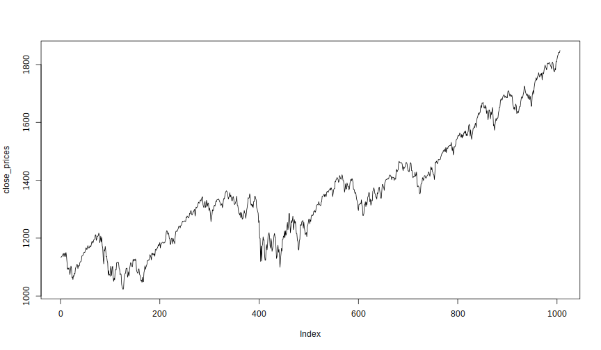
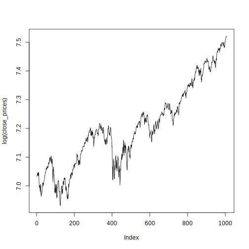
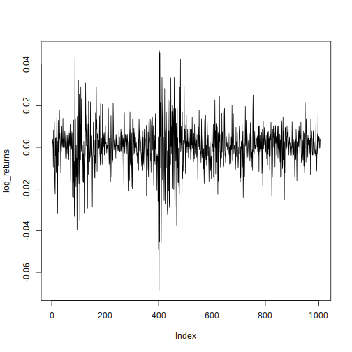
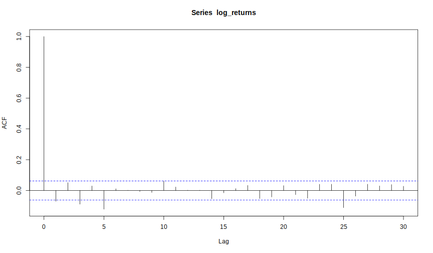
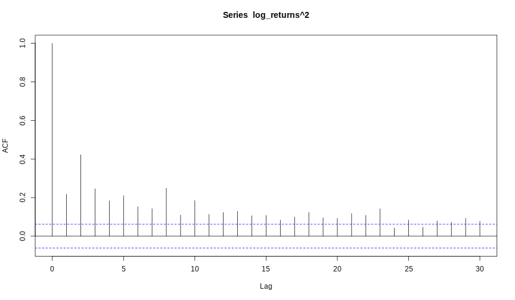

# Solutions


```r
> # Solution Exercise 1
> Quandl.search("S&P 500", database_code = "YAHOO")
```

```
SPDR S&P 500 (SPY)
Code: YAHOO/INDEX_SPY
Desc: SPY: SPDR S&P 500 (SPY)
Freq: daily
Cols: Date | Open | High | Low | Close | Volume | Adjusted Close

S&P 500 Index
Code: YAHOO/INDEX_GSPC
Desc: GSPC: S&P 500 Index. The S&P 500, or the Standard & Poor's 500, is an American stock market index based on the market capitalizations of 500 large companies having common stock listed on the NYSE or NASDAQ.
Freq: daily
Cols: Date | Open | High | Low | Close | Volume | Adjusted Close

S27: SPDR S&P500 10US$
Code: YAHOO/SI_S27
Desc:  Currency: SGD
Freq: daily
Cols: Date | Open | High | Low | Close | Volume | Adjusted Close

I17: IS S&P500 10US$
Code: YAHOO/SI_I17
Desc: There is no Profile data available for I17.SI. Currency: SGD
Freq: daily
Cols: Date | Open | High | Low | Close | Volume | Adjusted Close

MDSRX: Blackrock S&P 500 Index A
Code: YAHOO/FUND_MDSRX
Desc: The investment seeks to match the performance of the Standard & Poor&#39;s® 500 Index (the 'S&P 500') as closely as possible before the deduction of fund expenses.
 The fund is a 'feeder' fund that invests all of its assets in Master S&P 500 Index Series of Quantitative Master Series LLC, which has the same investment objective and strategies as the fund. It will be substantially invested in securities in the S&P 500, and will invest, under normal circumstances, at least 80% of its assets in securities or other financial instruments that are components of or have economic characteristics similar to the securities included in the S&P 500.
Freq: daily
Cols: Date | Open | High | Low | Close | Volume | Adjusted Close

S&P 500 Dividend Aristocrats (^SPDAUDP)
Code: YAHOO/SPDAUDP
Desc: This dataset has no description.
Freq: daily
Cols: Date | Open | High | Low | Close

S&P 500 Managed Distribution In (^SPXMDUT)
Code: YAHOO/SPXMDUT
Desc: This dataset has no description.
Freq: daily
Cols: Date | Open | High | Low | Close

S&P 500 Dividend Aristocrats (T (^SPDAUDT)
Code: YAHOO/SPDAUDT
Desc: This dataset has no description.
Freq: daily
Cols: Date | Open | High | Low | Close

S&P 500 Managed Distribution In (^SPXMDUP)
Code: YAHOO/SPXMDUP
Desc: This dataset has no description.
Freq: daily
Cols: Date | Open | High | Low | Close

Ishares S&P 500 (IVV.AX)
Code: YAHOO/ASX_IVV_AX
Desc: Historical stock prices for Ishares S&P 500 (IVV.AX). The fund invests at least 90% of assets in S&P 500 index securities. The index measures the performance of the large-capitalization sector of the U.S. equity market. As of May 31, 2010, the index included approximately 75% of the market capitalization of all publicly-traded U.S. equity securities.
Freq: daily
Cols: Date | Open | High | Low | Close | Volume | Adjusted Close
```

```r
> sp500 <- Quandl("YAHOO/INDEX_GSPC.4",
+                 start_date = "2010-01-01", end_date = "2014-12-31",
+                 order = "asc")
> 
> close_prices <- sp500[,"Close"]
> 
> # Solution Exercise 2
> plot(close_prices, type = "l") # Random Walk (with drift)
```



```r
> plot(log(close_prices), type = "l") # Random Walk (with drift)
```



```r
> log_returns <- diff(log(close_prices))
> plot(log_returns, type = "l")
```



```r
> acf(log_returns)
```



```r
> acf(log_returns^2)
```



```r
> # Solution Exercise 3
> garch_fit <- garchFit(formula = ~ garch(1,1), data = log_returns,
+                       include.mean = FALSE, trace = FALSE)
> 
> summary(garch_fit)
```

```
Length  Class   Mode 
     1 fGARCH     S4 
```

```r
> garch_fit_std <- garchFit(formula = ~ garch(1,1), data = log_returns,
+                           cond.dist = "std", include.mean = FALSE, trace = FALSE)
> 
> summary(garch_fit_std)
```

```
Length  Class   Mode 
     1 fGARCH     S4 
```

```r
> # The model with lower AIC, BIC, ...
> 
> garch_fit@fit$ics
```

```
      AIC       BIC       SIC      HQIC 
-6.632898 -6.620639 -6.632910 -6.628291 
```

```r
> garch_fit_std@fit$ics
```

```
      AIC       BIC       SIC      HQIC 
-6.667041 -6.650695 -6.667061 -6.660898 
```

```r
> # Solution Exercise 4
> vola_forecast <- function(fit, n.ahead=1) {
+   # fit is an object of class "fGarch"
+   vola <- numeric(n.ahead + 1)
+   coefs <- coef(fit)
+   h_init <- fit@h.t[length(fit@h.t)] # last value of fitted sigma^2
+   eps <- fit@residuals[length(fit@residuals)]  # last value of eps_t
+   
+   h <- coefs["omega"] + coefs["alpha1"] * eps^2 +
+        coefs["beta1"] * h_init # one-step ahead forecast
+   
+   if(n.ahead == 1) {
+     res <- h
+     names(res) <- NULL
+     return(sqrt(res))
+   } else {
+     vola_part1 <- coefs["omega"] *
+                   (1 - (coefs["alpha1"] + coefs["beta1"])^(1:(n.ahead-1)))/
+                   (1 - (coefs["alpha1"] + coefs["beta1"]))
+     
+     vola_part2 <- (coefs["alpha1"] + coefs["beta1"])^(1:(n.ahead-1)) * h
+   
+     vola <- vola_part1 + vola_part2
+     res <- c(h,vola)
+     names(res) <- NULL
+     return(sqrt(res))
+   }
+ }
```
