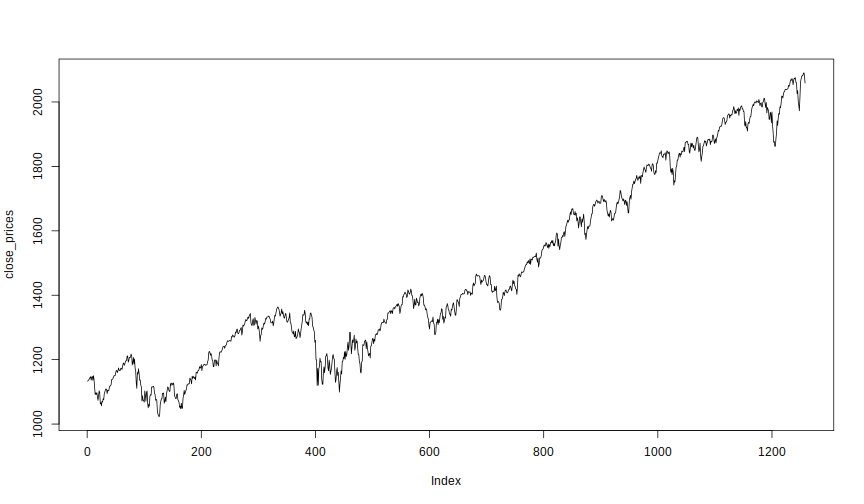
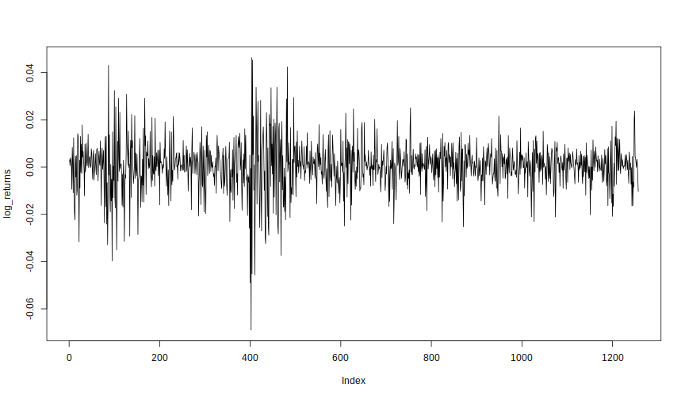
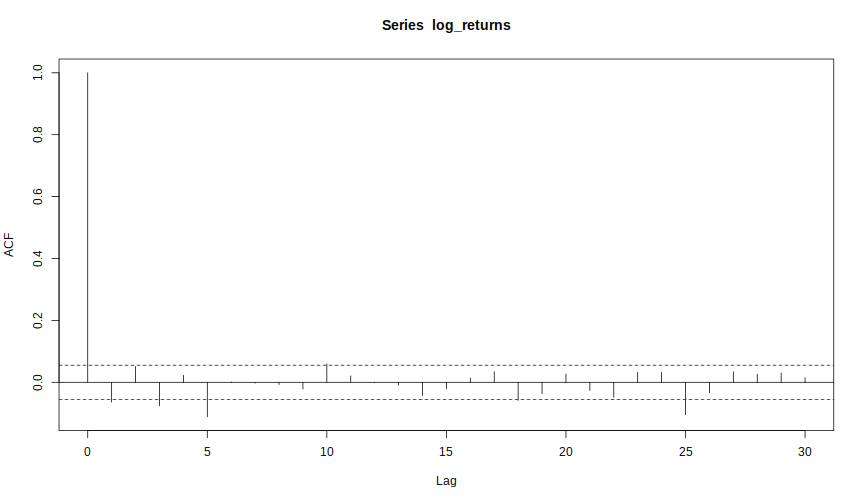
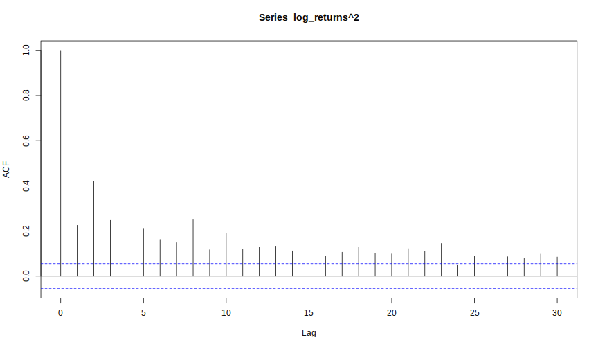

# Solutions


```r
> # Solution Exercise 1
> Quandl.search("S&P 500", source = "YAHOO")
```

```
S: Sprint Corporation Common Stock -
Code: YAHOO/S
Desc: Exchange : . Key Statistics
Freq: daily
Cols: c("Date", "Open", "High", "Low", "Close", "Volume", "Adjusted Close")

SPLI: AVWORKS AVIATION -
Code: YAHOO/SPLI
Desc: Exchange : . Key Statistics
Freq: daily
Cols: c("Date", "Open", "High", "Low", "Close", "Volume", "Adjusted Close")

SCBT: First Financial Holdings, Inc. -
Code: YAHOO/SCBT
Desc: Exchange : . Key Statistics
Freq: daily
Cols: c("Date", "Open", "High", "Low", "Close", "Volume", "Adjusted Close")
```

```r
> sp500 <- Quandl("YAHOO/INDEX_GSPC.4",
+                 start_date = "2010-01-01", end_date = "2014-01-01",
+                 sort = "asc")
> 
> close_prices <- sp500[,"Close"]
> 
> # Solution Exercise 2
> plot(close_prices, type = "l") # Random Walk (with drift)
```

 

```r
> plot(log(close_prices), type = "l") # Random Walk (with drift)
```

 

```r
> log_returns <- diff(log(close_prices))
> plot(log_returns, type = "l")
```

 

```r
> acf(log_returns)
```

 

```r
> acf(log_returns^2)
```

 

```r
> # Solution Exercise 3
> garch_fit <- garchFit(formula = ~ garch(1,1), data = log_returns,
+                       include.mean = FALSE, trace = FALSE)
> garch_fit_std <- garchFit(formula = ~ garch(1,1), data = log_returns,
+                           cond.dist = "std", include.mean = FALSE, trace = FALSE)
> 
> # The model with lower AIC, BIC, ...
> 
> 
> # Solution Exercise 4
> vola_forecast <- function(fit, n.ahead=1, cond.dist = c("norm", "std")) {
+   # fit is an object of class "fGarch"
+   vola <- numeric(n.ahead + 1)
+   coefs <- coef(fit)
+   h_init <- fit@h.t[length(fit@h.t)] # last value of fitted sigma^2
+   eps <- fit@residuals[length(fit@residuals)]  # last value of eps_t
+   
+   h <- coefs["omega"] + coefs["alpha1"] * eps^2 +
+        coefs["beta1"] * h_init # one-step ahead forecast
+   
+   if(n.ahead == 1) {
+     res <- h
+     names(res) <- NULL
+     return(sqrt(res))
+   } else {
+     vola_part1 <- coefs["omega"] *
+                   (1 - (coefs["alpha1"] + coefs["beta1"])^(1:(n.ahead-1)))/
+                   (1 - (coefs["alpha1"] + coefs["beta1"]))
+     
+     vola_part2 <- (coefs["alpha1"] + coefs["beta1"])^(1:(n.ahead-1)) * h
+   
+     vola <- vola_part1 + vola_part2
+     res <- c(h,vola)
+     names(res) <- NULL
+     return(sqrt(res))
+   }
+ }
```
