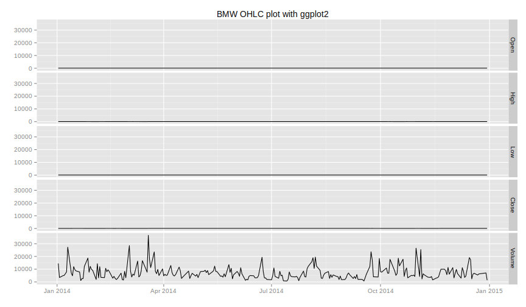
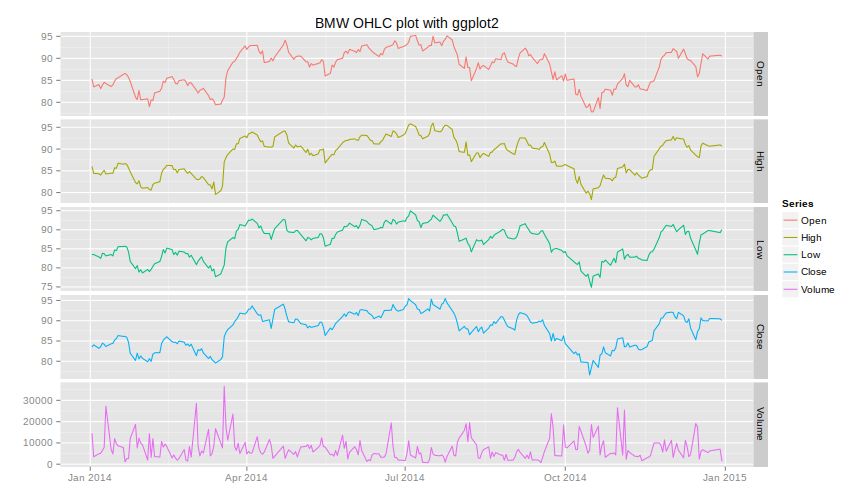

# ggplot2 Package

The `autoplot.zoo()` function in the `zoo` package provides an easy-to-use interface
to the very powerful [`ggplot2`](http://ggplot2.org/) package which provides a plotting system for *R*
based on the [grammar of graphics](http://www.amazon.de/The-Grammar-Graphics-Statistics-Computing/dp/0387245448).


```r
> library(ggplot2)
> 
> autoplot.zoo(bmw_2014_xts, main = "BMW OHLC plot with ggplot2") + xlab("")
```



We see that the scaling on the y axis is not correct. 
We use the `facet_free()` function to allow for different scales on the multiple y axis.


```r
> autoplot.zoo(bmw_2014_xts, 
+              main = "BMW OHLC plot with ggplot2",
+              facets = NULL) + xlab("") +  facet_free()
```


