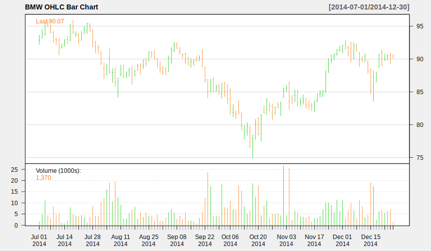

# quantmod Package

With the help of `chartSeries()` function we can take advantage of the fact that we have OHLC data.
Before we can use the function we have to load (or first install) the `quantmod` package.


```r
> library(quantmod)
```


```r
> chartSeries(bmw)
```

Trying to use the `chartseries()` function with the *BMW* time series downloaded as `data.frame` from Chapter 1
we get the following error.


```
Error in try.xts(x, error = "chartSeries requires an xtsible object") : 
  chartSeries requires an xtsible object
```

This error message shows us that we need on object of class `xts` or at least an object that can be converted to have class `xts`.
Remember that we have the possibility to tell `Quandl()` to return the data in the desired format.


```r
> bmw_2014_xts <- Quandl("GOOG/FRA_BMW",
+                        start_date = "2014-01-01", end_date = "2014-12-31",
+                        sort = "asc", type = "xts")
> class(bmw_2014_xts)
```

```
[1] "xts" "zoo"
```

Now we are ready to produce OHLC plots with `chartSeries()` using the default settings.

```r
> chartSeries(bmw_2014_xts)
```

 

The function call above produces a [candlestick plot](https://en.wikipedia.org/wiki/Candlestick_chart) for our OHLC data.

We can change the title of the plot and turn the background from black to white and switch from candlestick chart to [bar chart](https://en.wikipedia.org/wiki/Open-high-low-close_chart).


```r
> chartSeries(bmw_2014_xts, name = "BMW OHLC Bar Chart",
+             type = "bars",
+             theme = chartTheme("white"))
```

 

We can even zoom into the chart. Assume that we are interested only in the data for September 2014.


```r
> zoomChart("2014-09::2014-09")
```

 

The current active plot is the one for September 2014 data,
to choose another zoom range we have to first set the active plot back to our original data
which is the year 2014 with `zoomChart()` without any arguments.


```r
> zoomChart()
```

We can now set a new time span, for example the second half of the year.

```r
> zoomChart("2014-07::")
```

 

For more details about the usage of `chartSeries()` function have a look at the help page
or browse to the [quantmod package's website](www.quantmod.com).
